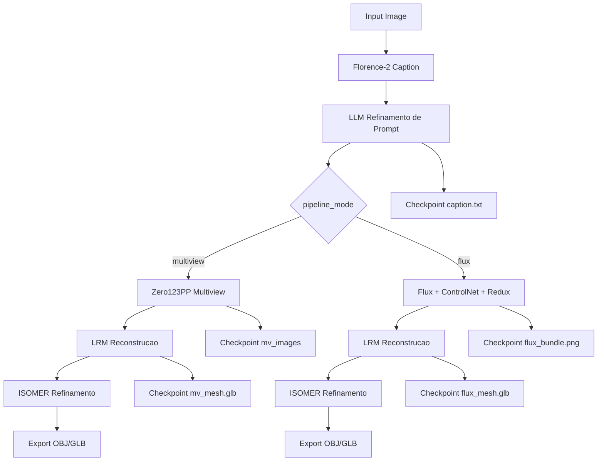

# Mesh3D Generator - Geração de Malhas 3D a partir de Imagens

Projeto de Visão Computacional para gerar malhas 3D a partir de uma ou mais imagens, utilizando LLM multimodal para gerar descrições extremamente detalhadas da cena que guiam o refinamento da malha.

## Estrutura do Projeto



## 📋 Objetivo

Gerar uma malha 3D a partir de uma ou mais imagens, onde primeiro um texto descritivo da cena será gerado utilizando LLM para gerar o texto extremamente detalhado. O normal map e outras informações serão usadas de forma que a malha seja refinada de acordo com o texto e com essas técnicas.

## 🎯 Pipeline do Projeto

O projeto segue o seguinte pipeline:

1. **Geração de Texto Detalhado com LLM**: Análise da(s) imagem(ns) usando LLM multimodal (llava/bakllava) para gerar descrição extremamente detalhada da cena
2. **Geração de Normal Maps**: Extração de normal maps a partir da imagem de entrada
3. **Inicialização da Malha**: Criação da malha inicial usando LRM ou Sphere init (InstantMesh)
4. **Refinamento da Malha**: Melhoria da malha usando ControlNet-Tile e ControlNet-Normal + texto descritivo detalhado gerado pelo LLM

## 🚀 Instalação

## ⚙️ Ambiente e Dependências

### Requisitos mínimos de hardware

| Recurso | Mínimo | Recomendado |
|---------|--------|-------------|
| GPU      | 12 GB VRAM (RTX 3060 Ti / 4070) | 24 GB+ (RTX 4090 / A6000) |
| RAM      | 32 GB                          | 64 GB+                    |
| Disco    | 60 GB livres (modelos + cache) | 120 GB                    |

> **Atenção**: o pipeline carrega múltiplos modelos (Flux, ControlNet, Zero123++, LRM, ISOMER, Florence-2). Com 12 GB de VRAM é obrigatório usar `--fast-mode` (ativa offload agressivo e reduz steps). Em VRAM menores que 10 GB o pipeline Flux não cabe.

### Pré-requisitos de software

- **Python 3.11.9** (OBRIGATÓRIO)
- **CUDA Toolkit 12.4** (funciona com 12.1/12.2; 11.x não é suportado pela versão atual do FLUX)
- **Visual Studio Build Tools 2019** (componentes “Desktop development with C++” para compilar `renderutils_plugin`)
- **Ninja** (já incluído no repositório, mas mantenha no `PATH` para garantir)
- **Conta HuggingFace** autenticada (`huggingface-cli login`)
- **Git LFS** para baixar checkpoints grandes

### Repositórios necessários

Este projeto incorpora o **Kiss3DGen** como submódulo/pasta. A organização recomendada:

```
D:\Visao_Computacional\2025_2\
├── mesh3d-generator (este repo)
├── Kiss3DGen (já incluso dentro de mesh3d-generator/Kiss3DGen)
└── data\
    └── raw\gazebo_dataset\images\*.jpg  # dataset local
```

Se quiser trabalhar fora desta estrutura, mantenha a variável `PROJECT_ROOT` apontando para a pasta que contém `Kiss3DGen/`.

### Modelos necessários

| Modelo                         | Origem                                  | Destino                                                     |
|-------------------------------|-----------------------------------------|-------------------------------------------------------------|
| `flux1-dev-fp8.safetensors`   | HuggingFace                             | `models/`                                                   |
| ControlNet (`Union`)          | HuggingFace                             | `checkpoint/flux_controlnet/`                               |
| LoRA Redux (`Flux.1-Redux`)   | HuggingFace                             | `checkpoint/flux_lora/`                                     |
| `Zero123++` + UNet custom     | Release Kiss3DGen                       | `models/zero123plus/`                                       |
| `LRM final_ckpt.ckpt`         | Release LRM                             | `Kiss3DGen/checkpoint/lrm/`                                 |
| `Florence-2 large no flash`   | HuggingFace                             | cache automático em `Kiss3DGen/.cache/`                     |
| Assets ISOMER / nvdiffrast    | Incluídos                               | `Kiss3DGen/models/ISOMER/`                                  |

Use `python scripts/download_models.py` para Flux/ControlNet/Zero123, e `python scripts/download_lrm.py` para o LRM. Verifique se os diretórios aparecem conforme tabela.

### Issues conhecidas / falhas esperadas

| Sintoma | Causa | Mitigação |
|---------|-------|-----------|
| `renderutils_plugin` recompila a cada run e falha com `LNK1104` | plugin tenta re-linkar dentro de `%APPDATA%` sem permissões | Defina `TORCH_EXTENSIONS_DIR=D:\...\torch_extensions_cache` e pré-compile com `python scripts/precompile_nvdiffrast.py --clean`. Se falhar, copie manualmente `renderutils_plugin.pyd` liberado pelo time para `mesh3d-generator-py3.11\Lib\site-packages`. |
| Objetos saem dessaturados (tons de cinza) | LRM gera vertex colors em float 0–1 e o export/clamp estava convertendo indevidamente | Atualizamos `save_py3dmesh_with_trimesh_fast_local` para preservar sRGB e exportar RGBA uint8. Se ainda notar cores lavadas, verifique `outputs/tmp/*_recon_from_kiss3d.png`: se já estiverem cinza, o problema vem do bundle (revise a imagem de entrada/caption). |
| VRAM insuficiente / OOM | `pipeline_mode=flux` carrega Flux+ControlNet+Zero123++/LRM simultaneamente | Use `--fast-mode` (desativa Redux/ControlNet e libera VRAM agressivamente), reduza `num_inference_steps`, ou opere em `--pipeline-mode multiview`. |

### Fluxo completo de instalação (Windows)

#### Setup Rápido

```powershell
# 1. Instalar Python 3.11.9
# Baixar de: https://www.python.org/downloads/release/python-3119/
# Marcar "Add Python to PATH" durante instalação

# 2. Configurar ambiente virtual Python 3.11.9
.\scripts\setup_python311.ps1
# OU
.\scripts\setup_python311.bat

# 3. Ativar ambiente virtual
.\mesh3d-generator-py3.11\Scripts\Activate.ps1

# 4. Instalar PyTorch com CUDA (ajustar versão CUDA conforme sua GPU)
pip install torch torchvision torchaudio --index-url https://download.pytorch.org/whl/cu121

# 5. Instalar todas as dependências
pip install -r requirements.txt
# OU usar script automatizado:
python scripts/install_dependencies.py

# 6. Instalar diffusers customizado do Kiss3DGen
cd Kiss3DGen
pip install -e custom_diffusers/
cd ..

# 7. Autenticar no HuggingFace
huggingface-cli login
# OU
python scripts/setup_huggingface_auth.py

# 8. Baixar modelos necessários
python scripts/download_models.py
python scripts/download_redux.py  # Opcional
python scripts/download_lrm.py   # Opcional
# 9. Pré-compilar renderutils_plugin (nvdiffrast)
python scripts/precompile_nvdiffrast.py --clean
```

#### Setup Manual

```bash
# 1. Criar ambiente virtual com Python 3.11.9
python3.11 -m venv mesh3d-generator-py3.11

# 2. Ativar ambiente virtual
# Windows:
.\mesh3d-generator-py3.11\Scripts\activate
# Linux/Mac:
source mesh3d-generator-py3.11/bin/activate

# 3. Atualizar pip
pip install --upgrade pip setuptools wheel

# 4. Instalar PyTorch com CUDA
pip install torch torchvision torchaudio --index-url https://download.pytorch.org/whl/cu121

# 5. Instalar dependências
pip install -r requirements.txt

# 6. Instalar pacotes via git (requer Visual Studio Build Tools no Windows)
pip install git+https://github.com/NVlabs/nvdiffrast
pip install "git+https://github.com/facebookresearch/pytorch3d.git@stable"

# 7. Instalar diffusers customizado
cd Kiss3DGen
pip install -e custom_diffusers/
cd ..
# 8. Pré-compilar nvdiffrast (opcional mas recomendado)
python scripts/precompile_nvdiffrast.py --clean
```

## 📁 Estrutura do Projeto

```
mesh3d-generator/
├── mesh3d_generator/
│   ├── __init__.py
│   ├── llm/                    # Etapa 0: Geração de texto a partir de imagens
│   │   ├── __init__.py
│   │   └── text_generator.py
│   ├── normal_maps/            # Etapa 1: Geração de normal maps
│   │   ├── __init__.py
│   │   └── generator.py
│   ├── mesh_initialization/    # Etapa 2: Inicialização da malha
│   │   ├── __init__.py
│   │   ├── lrm.py
│   │   └── instant_mesh.py
│   ├── mesh_refinement/        # Etapa 3: Refinamento da malha
│   │   ├── __init__.py
│   │   └── refiner.py
│   ├── utils/
│   │   ├── __init__.py
│   │   ├── data_loader.py
│   │   └── visualization.py
│   └── config/
│       └── config.yaml
├── data/
│   ├── raw/                   # Imagens de entrada
│   ├── processed/
│   └── outputs/               # Malhas 3D geradas
├── notebooks/
│   └── experiments.ipynb
├── tests/
│   └── test_basic.py
├── scripts/
│   ├── download_dataset.py
│   ├── run_pipeline.py
│   └── test_ollama.py
├── pyproject.toml
├── README.md
├── PLANNING.md
└── .gitignore
```

## 🏃‍♀️ Executando o Pipeline

### Um único objeto (imagem local)

```powershell
.\mesh3d-generator-py3.11\Scripts\python.exe scripts\run_kiss3dgen_image_to_3d.py `
    --input "data/inputs/bottle.png" `
    --output "outputs/bottle_generation" `
    --config "pipeline_config/default.yaml" `
    --pipeline-mode flux `
    --enable-redux `
    --use-controlnet `
    --use-mv-rgb
```

Parâmetros úteis:

- `--fast-mode`: reduz consumo de VRAM (desliga Redux/ControlNet e força limpeza agressiva de modelos).
- `--pipeline-mode multiview`: usa Zero123++ diretamente (sem Flux), exigindo menos VRAM porém com menos fidelidade.
- `--dataset-item` / `--dataset-view`: seleciona imagens prontas em `data/raw/gazebo_dataset/images`.
- `--dataset-plan`: executa um YAML com vários objetos em sequência.
- `--gt-mesh`: fornece mesh de referência para cálculo automático de Chamfer/F-score.

Resultados:

- `outputs/<uuid>.obj/.glb`: mesh direto do LRM (sem ISOMER) — usa vertex colors preservados e é o fallback quando o nvdiffrast falha.
- `outputs/<uuid>_isomer.obj/.glb`: mesh refinado pelo ISOMER (necessita `renderutils_plugin` funcional).
- `outputs/tmp/`: contém bundles intermediários (`*_flux_seed_bundle.png`, `*_generated_bundle.png`, `*_recon_from_kiss3d.png`) usados para depuração de cores.

### Batch com vários objetos (dataset plan)

```powershell
python scripts/run_kiss3dgen_image_to_3d.py `
    --dataset-plan pipeline_config/flux_top10_dataset.yaml `
    --output outputs/flux_top10_dataset `
    --pipeline-mode flux `
    --fast-mode
```

Cada entrada do YAML gera um diretório em `outputs/<name>_<uuid>/views/*` e um `runs_report.json` com métricas ordenadas. Use essa abordagem para processar o dataset do Gazebo ou qualquer CSV/YAML próprio (basta apontar `--dataset-root`).

## 📅 Schedule e Timeline

Consulte o arquivo [PLANNING.md](PLANNING.md) para o planejamento detalhado e cronograma completo.

### Resumo do Cronograma

- **Semana 1-2**: Setup do ambiente e estudo do Kiss3DGen
- **Semana 3-4**: Implementação da geração de texto detalhado com LLM multimodal a partir de imagens
- **Semana 5-6**: Implementação da geração de Normal Maps
- **Semana 7-8**: Implementação da inicialização de malha (LRM/InstantMesh)
- **Semana 9-10**: Implementação do refinamento de malha
- **Semana 11-12**: Integração completa do pipeline (texto + normal maps + refinamento)
- **Semana 13-14**: Testes e validação com dataset do Google Research
- **Semana 15-16**: Refinamentos finais e documentação

## 🔧 Uso Básico

```python
from mesh3d_generator import TextGenerator, NormalMapGenerator, MeshRefiner
from mesh3d_generator.mesh_initialization import InstantMeshInitializer
from PIL import Image

# 1. Gerar texto detalhado a partir da imagem
text_generator = TextGenerator()
image = Image.open("data/raw/chair.jpg")
detailed_text = text_generator.generate_from_image(image)

# 2. Gerar normal map
normal_generator = NormalMapGenerator()
normal_map = normal_generator.generate(image)

# 3. Inicializar malha
mesh_initializer = InstantMeshInitializer()
mesh = mesh_initializer.initialize(image, normal_map)

# 4. Refinar malha com texto e normal map
mesh_refiner = MeshRefiner()
refined_mesh = mesh_refiner.refine(mesh, detailed_text, normal_map)

# 5. Salvar a malha
refined_mesh.export("outputs/chair.obj")
```

## 🤖 Integração com Ollama

O projeto usa **Ollama** para modelos LLM locais, incluindo modelos multimodais para análise de imagens e geração de descrições detalhadas.

### Setup Rápido
```bash
# Instalar Ollama (se ainda não tiver)
# Windows: https://ollama.com/download
# Linux/Mac: curl -fsSL https://ollama.com/install.sh | sh

# Instalar modelos
ollama pull llama3.2  # Modelo textual (opcional, para melhorias de texto)
ollama pull llava     # Modelo multimodal (ESSENCIAL - para análise de imagens)

# Testar integração
poetry run python scripts/test_ollama.py
```

### Uso do LLM Multimodal

```python
from mesh3d_generator import TextGenerator
from PIL import Image

# Inicializar gerador com modelo multimodal
text_generator = TextGenerator(
    model_name="llama3.2",      # Para processamento de texto
    multimodal_model="llava"    # Para análise de imagens
)

# Gerar descrição detalhada a partir de imagem
image = Image.open("data/raw/scene.jpg")
detailed_description = text_generator.generate_from_image(image)
print(detailed_description)
```

## 📚 Recursos

- **Dataset**: [Google Research Dataset](https://app.gazebosim.org/GoogleResearch)
- **Codebase Base**: [Kiss3DGen](https://github.com/EnVision-Research/Kiss3DGen)
- **Conferência**: [CVPR 2025](https://openaccess.thecvf.com/CVPR2025)
- **Ollama**: [Documentação](https://github.com/ollama/ollama)

## 🤝 Contribuição

Este é um projeto acadêmico. Para contribuições, por favor abra uma issue ou pull request.

## 📝 Licença

Este projeto é para fins acadêmicos.


